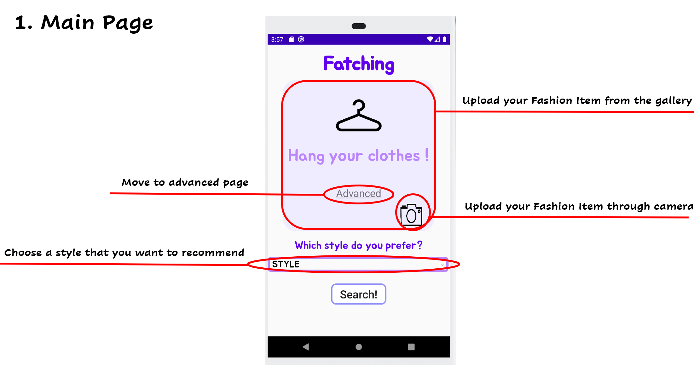
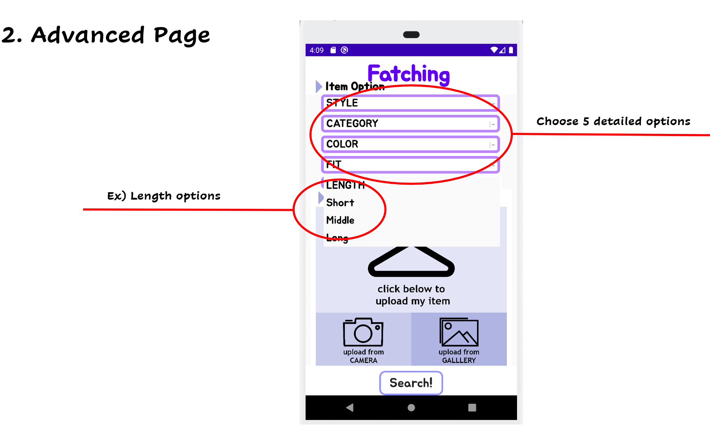
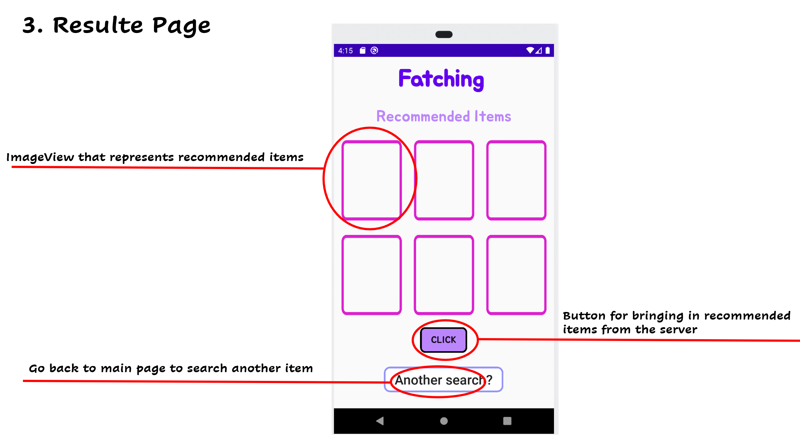

# Fetching: Deep Learning Based Fashion Recommendation Application
[SWE3028-41] Capstone Design <br />
Contact e-mail : kim0112hg@naver.com <br />
Demo Video : https://www.youtube.com/watch?v=hQmCSHVULcM <br />

## Introduction
This is an android application for user who wants to get recommendations from someone.
1. The recommedations are done by AI.
2. Users who use the app can just take pictures and upload them or bring them from the gallery.
3. Users can receive recommendations only with information such as color, category, length, and fit, even if they do not have clothes they have.
4. However, the difference between other recommendation systems and this app is that users can receive recommendations for **THEIR** clothes.

## Development Environment
- Python under 3.6.x 
- Tensorflow
- Flask
- Android Studio @3.5.3

## Application Version
- minSdkVersion : 15
- targetSdkVersion : 26

## Files
- app.py : This is a file to run the server. If you want to run the server yourself, just install a **Python version below 3.6, flask, tensorflow** and **change the IP** address to open the server and run it.
- *.models or h5 files : These are deep learning model files that process images received through the server. Please put "models" folder in the same directory as app.py.
- Fatching : This is the main application. If you opened the server yourself, please change the ip address in the application SearchFragment.kt that communicates with the server.
- mannish_* : These are small datasets that can test the model, and adding the dataset to this folder allows more diverse recommendations. Don't change the folder name. Please place the folder in the same directory as app.py
- return_type.py : This is a python file that uses the deep learning model (.h5 files). <Br /><Br /><Br />

# Application
### The application has total 3 pages.
 
<br />

```
This page is the main page.
The user can do three actions here.
1. Bringing pictures from the gallery.
2. Bring a picture from the camera.
3. Enter the desired style and move on to the search page.
If you don't like all of the above, you can click "Advanced" to enter a more advanced search page
```
<br />


```
This page is an advanced page.
1. The user can do the same thing as the previous page here. 
2. However, on this page, user can add five more detailed options.
3. User don't even have to bring clothes from the camera or gallery.
```


```
This page is the result page.
1. When the users presse the click button on this page, the image recommended by the deep learning model show the six image to 6 imageviews.
2. If users don't like clothes, user can click again to get an image.
3. If users want to search for other clothes, press Another search button.
```